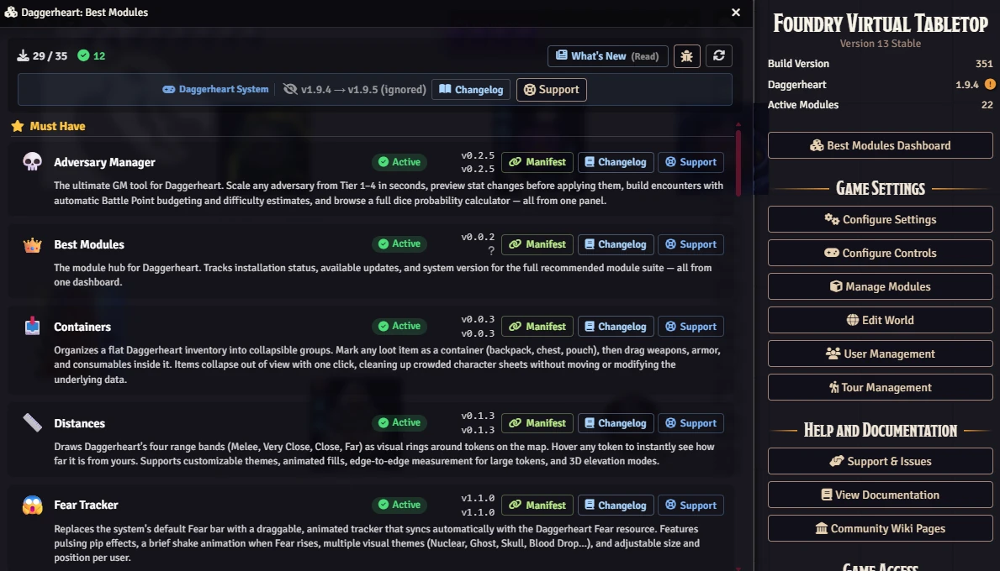

# 👑 Recommended Modules for Daggerheart

> **One module to rule them all.**

Install this and instantly know which modules will make your Daggerheart sessions on Foundry VTT faster, smoother, and more cinematic — no searching, no guesswork.

---

## What Is This?

**Best Modules for Daggerheart** is a curator dashboard that lives inside Foundry VTT.

When you load your world, it automatically checks which recommended modules you have installed, which ones are missing, and whether any of them have updates available. Everything is visible in one panel — no need to dig through the module manager.

Think of it as a personal assistant that keeps your Daggerheart toolkit organized and up to date.

---

## Why Should I Install This?

- 🟢 **See at a glance** which essential modules you have and which ones you're missing
- 🔔 **Get notified automatically** when any recommended module has an update — no manual checking
- 📋 **Install any module in seconds** by copying its manifest URL directly from the panel
- 🔄 **Check if the Daggerheart system itself needs updating** — it tracks that too
- 📖 **Read changelogs** without leaving Foundry

You install this once. It saves you time.

<p align="center"></p>

---

## About this repository

This is a curated collection of modules for DH. This repository serves as a resource hub, gathering personal recommendations, widely-used community tools, and popular modules selected for their utility and quality.

The goal is to provide a comprehensive list for different playstyles. Inclusion in this list does not imply official endorsement, but rather a selection of resources found to be valuable by the maintainer and the broader community.

---

## Installation

1. Open Foundry VTT and go to **Configuration → Add-on Modules → Install Module**
2. Paste this manifest URL in the search box:

```
https://raw.githubusercontent.com/brunocalado/dh-best-modules/main/module.json
```

3. Click **Install**, then **Enable** the module in your world
4. That's it — the dashboard opens automatically on your next world load

---

## The Dashboard

Open the dashboard anytime from the **Best Modules Dashboard** button in Foundry's Settings sidebar.

The panel is divided into four sections:

| Section | What's In It |
|---|---|
| **Must Have** | Core modules that significantly improve every session |
| **Recommended** | Modules worth adding once you're comfortable with the basics |
| **Third Party — Daggerheart** | Community content built specifically for Daggerheart: adventures, content packs, and DH-specific tools |
| **Third Party** | General-purpose community modules that pair well with Daggerheart |

Each module card shows its current installed version, the latest available version, and action buttons to **install**, **enable**, or **copy the manifest URL**. Non-third-party modules also include a **Changelog** button to read what changed without leaving Foundry.

---

## Must-Have Modules

These are the modules the dashboard highlights as essential for any Daggerheart game:

### 💀 Adversary Manager
Scale any enemy from Tier 1–4 in seconds. Preview stat changes before applying them, budget encounters automatically with Battle Points, and use a built-in dice probability calculator. The single most powerful GM tool in this list.

### 📏 Distances
Draws Daggerheart's four range bands (Melee, Very Close, Close, Far) as visual rings directly on the map. Hover any token and instantly see how far away it is from yours. No more range debates at the table.

### 😱 Fear Tracker
Replaces the default Fear bar with a draggable, animated tracker that pulses and shakes as Fear rises. Multiple visual themes available. Every player can see Fear climbing in real time.

### 🎁 Mystery Box
Let players open loot boxes for randomized rewards. Choose between Percentage mode (each item rolls independently) or Raffle mode (guaranteed number of items drawn by weighted chance). Rewards land in inventory automatically, complete with optional confetti and sound effects.

### ⚡ Quick Actions
A sidebar menu with one-click tools for the most common mid-session needs: Falling Damage, Downtime, Request Roll (send a roll prompt to players), Help an Ally, Spotlight Token, and Level Up.

### 📜 Quick Rules
A floating, searchable rule reference that stays on screen while you play. Press **Shift+D** to open it. Pin your most-used rules as favorites, adjust font size, and even add your own house rules to a custom folder.

### 🛒 Store
A full in-game shop. Players browse items by category, compare stats against their current gear, and buy with automatic currency deduction. The GM controls prices, stock limits, sale discounts, and vendor identity.

### 🤝 Tag Team
Adds a Tag Team button directly to the character sheet. It validates that the character has the required 3 Hope, consumes it, and logs the move — no manual bookkeeping needed.

### 📥 Containers
Organizes a flat Daggerheart inventory into collapsible groups. Mark any item as a container, drag gear inside it, and collapse the whole group with one click. Cleans up crowded character sheets without changing the underlying data.

---

## Recommended Modules

Once you have the essentials running, these add cinematic and quality-of-life upgrades:

| Module | What It Does |
|---|---|
| 💥 **Critical** | Triggers screen effects and audio on Duality Dice matches, GM crits, and level-ups |
| ☠️ **Death Moves** | Turns Death Moves into a full-table cinematic event with a countdown timer and spectator screen |
| 📦 **Extra Content** | A homebrew compendium with additional ancestries, classes, and items |
| 🎲 **Stats** | Tracks every dice roll at the table and displays statistics over time |
| 🤖 **Fear Macros** | Fires custom macros automatically when Fear changes — wire lighting, music, anything |
| 🧠 **Stats Toolbox** | Paste a plain-text statblock and generate a fully populated Foundry actor instantly |
| 💠 **Custom Stat Tracker** | Add any custom resource tracker to an actor sheet — homebrew counters, conditions, anything |
| 🌀 **The Void (Unofficial)** | Adds full Void mechanics tracking and compendium content for dark campaigns |

---

## Third-Party — Daggerheart Modules

Community content built specifically for the Daggerheart system:

| Module | What It Does |
|---|---|
| 🖥️ **GM HUD** | Keeps key token stats visible at all times during combat — GM-facing overlay |
| 🎮 **Daggerheart HUD** | Always-visible overlay of HP, Stress, Hope, and Armor for players |
| 🎨 **Art for Daggerheart** | Drop-in character art and tokens for a wide range of ancestries and archetypes |
| ⚔️ **Martial Adversaries** | 60 new statblocks for warriors, soldiers, and military formations |
| 🧟 **Undead Adversaries** | 60 new statblocks for ghosts, ghouls, mummies, vampires, and more |
| 🗺️ **Quickstart Adventure: Sablewood Messengers** | The official Daggerheart quickstart adventure with 5 pre-made characters |
| 🍲 **Hotpot!** | A crafting and cooking system with custom ingredient and recipe item types |
| 🤖 **DH Motherboard** | Homebrew compendium for the Motherboard setting — frames, items, tables, and journals |
| 🪄 **I Wish (Adventure)** | A complete adventure: a cursed merchant's desperate expedition into a deadly mountain |
| 💣 **Suicide Squad (Adventure)** | A complete adventure: cursed criminals forced into an impossible mission in a land at war |
| ✨ **Daggerheart Plus** | UI and UX enhancements specifically designed for Daggerheart gameplay — improved styling and usability |
| 📋 **Daggerheart Sleek UI** | Alternative character sheet with improved layout, better resource management, and enhanced usability for players and GMs |

---

## Third-Party Modules

General-purpose community modules that work well alongside any Daggerheart setup:

| Module | What It Does |
|---|---|
| 📷 **Chat Media** | Embed images, videos, and audio directly in Foundry chat messages |
| 🎲 **Dice So Nice!** | 3D animated dice that physically roll across the screen before landing |
| 🪄 **Dice Tray** | Clickable dice palette below the chat box — no commands required |
| 👁️ **Ownership Viewer** | Shows at a glance which players can see which documents |
| 🧙 **Tokenizer** | Build token images from portraits inside Foundry, no external editor needed |
| ⏳ **Timeline Builder** | Create and manage campaign timelines |
| 🪲 **Group Tokens** | Collapse groups of tokens into a single token and back — useful for parties or formations |

---

## Update Notifications

On every world load, the dashboard automatically checks GitHub for updates to all recommended modules. If any updates are found, a notification panel opens.

You can:
- **Dismiss** a specific update so it never alerts you about that version again
- **Remind Later** to see the alert again on the next world load
- **View Changelog** to read exactly what changed before deciding to update (first-party modules only)

The Daggerheart **system** version is also tracked — if Foundryborne publishes a new release, the dashboard will flag it.

### Update Alert Settings

In **Settings → Module Settings** you can control which categories trigger alerts on world load:

| Setting | Default | What It Controls |
|---|---|---|
| Check for Updates on World Load | ✅ On | Master switch for all update checks |
| Alert on Third-Party Module Updates | ✅ On | Alerts for general third-party modules |
| Alert on Daggerheart-Specific Third-Party Module Updates | ✅ On | Alerts for DH adventures, content packs, and DH-specific tools |

---

## License and Credits

Licensed under GPL-3.0.